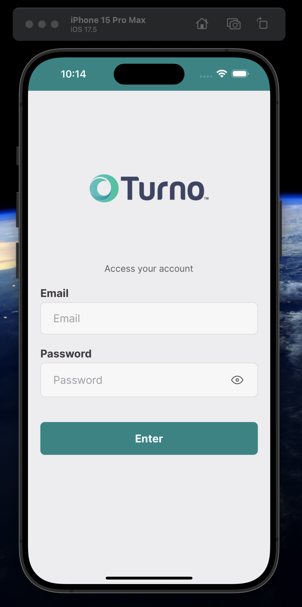
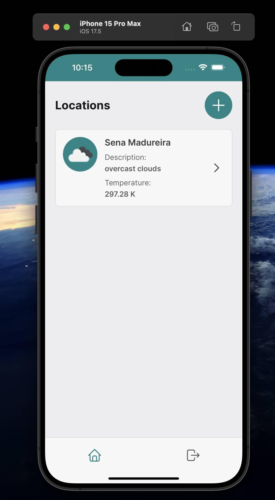
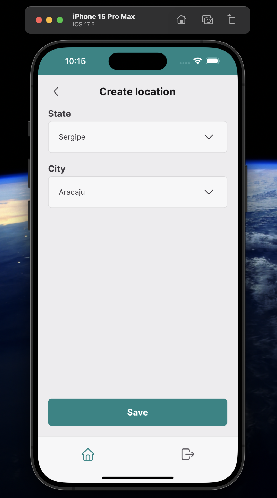
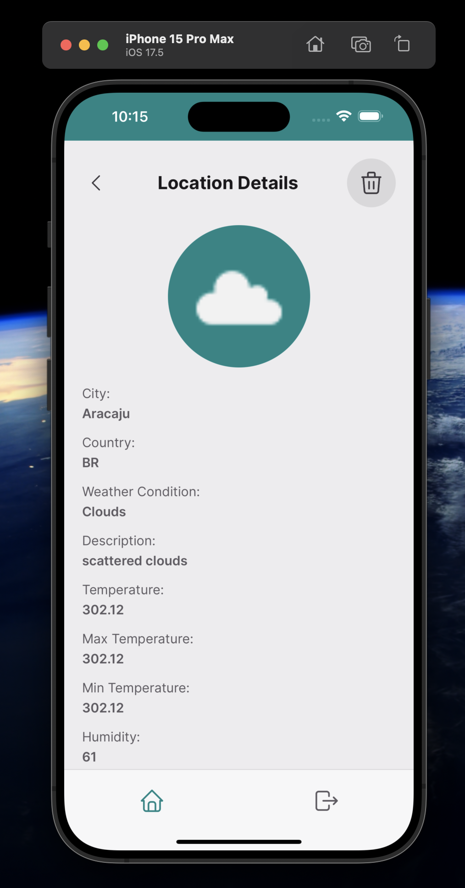

# Weather App

This is the repository for the Weather application.

## 📷 Screenshots

<div style="display: flex; justify-content: space-between;">






</div>

## 🛠️ Technologies Used

- **React Native**: A framework for building native apps using React, enabling a rich mobile experience.
- **Expo**: A framework and platform for universal React applications, streamlining development and deployment.
- **TypeScript**: A superset of JavaScript that adds static typing, improving code quality and maintainability.
- **Redux**: A predictable state container for JavaScript apps, facilitating the management of application state across components.
- **React Navigation**: A library for routing and navigation in React Native apps, enabling seamless transitions between screens.
- **React Hook Form**: A library for managing form state and validation, allowing for easy integration of form controls and enhancing performance by reducing re-renders.
- **Yup**: A JavaScript schema builder for validating and parsing user input, used in conjunction with React Hook Form to ensure data integrity and provide user-friendly error messages.
- **Styled Components**: A library for styling React components with tagged template literals, enhancing the visual presentation of the app.
- **React Native MMKV**: A fast key-value storage library for React Native, used for persisting data locally.
- **i18next**: A powerful internationalization framework for JavaScript, enabling multilingual support in the application.
- **Jest**: A JavaScript testing framework for unit testing, ensuring code quality and reliability.

## ⚙️ Features

- **Data Fetching**: Fetch and display live weather data from an external API, providing users with up-to-date information.
- **State Management**: Use Redux and Redux Toolkit for efficient state management, with React Native MMKV providing fast and persistent local storage.
- **Dynamic Routing**: Implement React Navigation to create a smooth and intuitive navigation experience across the app’s screens.
- **Form Validation**: Combine React Hook Form with Yup for robust form validation, ensuring that user inputs are properly validated, enhancing user experience and data integrity.
- **Persistent Storage**: Store user preferences and application data locally using React Native MMKV for quick access and offline support.
- **Localization Support**: Implement i18next for multilingual support, making the app accessible to a wider audience.
- **Animation Effects**: Leverage React Native Reanimated for smooth transitions and animations, enhancing the overall user interface.
- **Unit Testing**: Ensure code quality with unit tests using Jest and React Native Testing Library, verifying component functionality and behavior.

## 📦 Project Structure

```bash
src/
├── @types/              # TypeScript type definitions
├── assets/              # Static files like images, fonts, etc.
├── components/          # Reusable components across the application
├── domain/              # Domain logic and entities of the application
├── enums/               # Enum definitions used in the project
├── features/            # Redux reducers, organized by module
├── hooks/               # Custom hooks for reusable logic
├── lib/                 # External libraries and configurations
├── mock/                # Mock data for testing and development
├── query/               # API request functions
├── routes/              # Navigation route definitions
├── schemas/             # Form validation schemas
├── screens/             # Main screens of the application
├── services/            # Service functions related to APIs and other integrations
├── storage/             # Persistent storage configurations
├── store/               # State management
├── theme/               # Application styles and themes
└── utils/               # Utility functions and helpers

```

## 📚 Documentation

### Installation

To run the project locally, follow the steps below:

1. Clone the project:

```bash
git clone https://github.com/enzoodev/weather-app.git
```

2. Install dependencies:

```bash
yarn install
# or
npm install
```

3. Configure json-server for API mocking:

- Specify your private IP and desired port in the `.env` file.
- Update the `server` script in `package.json` with your private IP and chosen port.

4. Start the API server:

- Open a terminal and run.
```bash
yarn server
# or
npm run server
```

5. Start the development server:

- Open other terminal and run.
```bash
yarn start
# or
npm run start
```

6. Run on iOS:

- Open other terminal and run.
```bash
yarn ios
# or
npm run ios
```

7. Run Android:
- Open other terminal and run.
```bash
yarn android
# or
npm run android
```

## 📝 Observations

The original testing requirements specified the use of MirageJS for mocking the API. However, MirageJS caused issues when running the app on both Android and iOS platforms. As a result, I opted to use json-server for API mocking to streamline the development process without compromising functionality.
